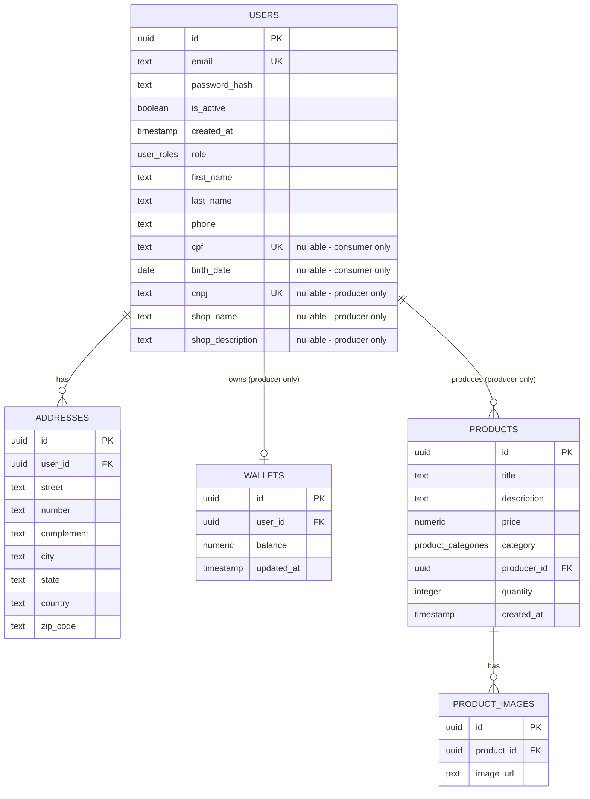

# Diagrama de Relacionamento - Hortifruti Boa Saúde API

## Visão Geral do Banco de Dados

Este documento apresenta o diagrama de relacionamento das entidades do sistema Hortifruti Boa Saúde, implementado com Drizzle ORM e PostgreSQL.

## Diagrama de Entidade-Relacionamento (Mermaid)



## Estrutura das Tabelas

### 1. Usuários (Tabela Unificada)

#### `users` - Todos os Tipos de Usuários
```
┌─────────────────────────────────────┐
│                users                │
├─────────────────────────────────────┤
│ id (UUID, PK)                       │
│ email (TEXT, UNIQUE)                │
│ password_hash (TEXT)                │
│ is_active (BOOLEAN, DEFAULT true)   │
│ created_at (TIMESTAMP)              │
│ role (user_roles ENUM)              │
│   - "consumer"                      │
│   - "producer"                      │
│   - "admin"                         │
│ first_name (TEXT)                   │
│ last_name (TEXT)                    │
│ phone (TEXT)                        │
│                                     │
│ -- Campos específicos por role --   │
│ cpf (TEXT, UNIQUE, nullable)        │
│   - Obrigatório para consumer       │
│ birth_date (DATE, nullable)         │
│   - Obrigatório para consumer       │
│ cnpj (TEXT, UNIQUE, nullable)       │
│   - Obrigatório para producer       │
│ shop_name (TEXT, nullable)          │
│   - Obrigatório para producer       │
│ shop_description (TEXT, nullable)   │
│   - Opcional para producer          │
└─────────────────────────────────────┘
```

### 2. Endereços

#### `addresses` - Endereços dos Usuários
```
┌─────────────────────────────────────┐
│              addresses              │
├─────────────────────────────────────┤
│ id (UUID, PK)                       │
│ user_id (UUID, FK)                  │
│ street (TEXT)                       │
│ number (TEXT)                       │
│ complement (TEXT)                   │
│ city (TEXT)                         │
│ state (TEXT)                        │
│ country (TEXT)                      │
│ zip_code (TEXT)                     │
└─────────────────────────────────────┘
```

### 3. Carteiras

#### `wallets` - Carteiras dos Produtores
```
┌─────────────────────────────────────┐
│               wallets               │
├─────────────────────────────────────┤
│ id (UUID, PK)                       │
│ user_id (UUID, FK)                  │
│ balance (NUMERIC(10,2))             │
│ updated_at (TIMESTAMP)              │
└─────────────────────────────────────┘
```

### 4. Produtos

#### `products` - Produtos dos Produtores
```
┌─────────────────────────────────────┐
│               products              │
├─────────────────────────────────────┤
│ id (UUID, PK)                       │
│ title (TEXT)                        │
│ description (TEXT)                  │
│ price (NUMERIC(10,2))               │
│ category (product_categories ENUM)  │
│   - "frutas"                        │
│   - "legumes"                       │
│   - "verduras"                      │
│   - "ervas"                         │
│   - "graos"                         │
│   - "tuberculos"                    │
│   - "hortalicas"                    │
│   - "organicos"                     │
│   - "ovos"                          │
│   - "mel"                           │
│   - "cogumelos"                     │
│   - "temperos"                      │
│   - "sementes"                      │
│   - "castanhas"                     │
│   - "integrais"                     │
│   - "conservas"                     │
│   - "compotas"                      │
│   - "polpa_fruta"                   │
│   - "polpa_vegetal"                 │
│   - "sazonal"                       │
│   - "flores_comestiveis"            │
│   - "vegano"                        │
│   - "kits"                          │
│   - "outros"                        │
│ producer_id (UUID, FK)              │
│ quantity (INTEGER, DEFAULT 0)       │
│ created_at (TIMESTAMP)              │
└─────────────────────────────────────┘
```

### 5. Imagens de Produtos

#### `product_images` - Imagens dos Produtos
```
┌─────────────────────────────────────┐
│            product_images           │
├─────────────────────────────────────┤
│ id (UUID, PK)                       │
│ product_id (UUID, FK)               │
│ image_url (TEXT)                    │
└─────────────────────────────────────┘
```

## Observações Técnicas

1. **Tabela Unificada de Usuários**: O sistema utiliza uma única tabela `users` com um enum `user_roles` para distinguir entre consumidores, produtores e administradores. Campos específicos por role são nullable e validados na aplicação.

2. **Enum de Roles**: O enum `user_roles` define três tipos: "consumer", "producer" e "admin", garantindo type safety, consistência no banco de dados e aplicação de RBAC (Role-Based Access Control).

3. **Campos Condicionais por Role**:
   - **Consumer**: Requer `cpf` e `birth_date`
   - **Producer**: Requer `cnpj` e `shop_name`, `shop_description` é opcional
   - **Admin**: Apenas campos básicos são necessários

4. **Relacionamento de Endereços**: A tabela `addresses` se relaciona com a tabela unificada `users` através do campo `user_id`, permitindo que qualquer tipo de usuário tenha endereços.

5. **Carteiras Exclusivas**: Apenas produtores possuem carteiras, com relacionamento 1:1 entre `users` e `wallets` (um produtor possui uma carteira).

6. **Sistema de Produtos**: Apenas produtores podem criar produtos. Cada produto pertence a um produtor específico e possui uma categoria definida pelo enum `product_categories`.

7. **Categorias de Produtos**: O enum `product_categories` define 24 categorias específicas para hortifrúti, incluindo frutas, legumes, verduras, produtos orgânicos, kits e outros.

8. **Imagens de Produtos**: Cada produto pode ter múltiplas imagens através da tabela `product_images`, com relacionamento 1:N e cascade delete (quando um produto é deletado, suas imagens também são removidas).

9. **Armazenamento de Imagens**: As imagens são armazenadas fisicamente na pasta `uploads/products/` e referenciadas na base de dados através da URL.

10. **Índices de Performance**: Todos os campos de email e documentos (CPF/CNPJ) possuem índices únicos para otimização de consultas e garantia de unicidade.
---

**Data de Atualização**: 27/01/2025  
**Versão do Schema**: 1.0 (Refatorado com Drizzle ORM)