# Diagrama de Fluxo - Sistema de Assinaturas Hortifrúti Boa Saúde

## Visão Geral

Este documento apresenta o fluxo completo de um cliente que navega pelos produtos, adiciona itens ao carrinho, realiza uma compra/assinatura e aguarda a aprovação dos produtores.

## Diagrama de Fluxo Completo

```mermaid
flowchart TD
    %% Início - Navegação Pública
    A[Cliente acessa a plataforma] --> B["GET /products/"]
    B --> C{Produtos disponíveis?}
    C -->|Sim| D[Visualizar lista de produtos]
    C -->|Não| E[Exibir mensagem: Nenhum produto disponível]
    
    %% Detalhes do Produto
    D --> F[Cliente seleciona produto]
    F --> G["GET /products/{id}/"]
    G --> H[Visualizar detalhes do produto]
    H --> I["GET /products/{id}/images/"]
    I --> J[Carregar imagens do produto]
    
    %% Decisão de Compra
    J --> K{Cliente quer comprar?}
    K -->|Não| D
    K -->|Sim| L{Cliente autenticado?}
    
    %% Autenticação
    L -->|Não| M[Fazer login/registro]
    M --> N{Login bem-sucedido?}
    N -->|Não| M
    N -->|Sim| O[Cliente autenticado como Consumer]
    L -->|Sim| O
    
    %% Seleção de Produtos para Pedido
    O --> P[Adicionar produtos ao carrinho]
    P --> Q{Adicionar mais produtos?}
    Q -->|Sim| D
    Q -->|Não| R[Finalizar seleção]
    
    %% Configuração do Pedido
    R --> S{Tipo de pedido?}
    S -->|Pedido único| T[Configurar pedido único]
    S -->|Assinatura| U[Configurar assinatura recorrente]
    
    %% Configuração de Assinatura
    U --> V[Selecionar frequência]
    V --> W{Frequência escolhida}
    W -->|WEEKLY| X[Entrega semanal]
    W -->|BIWEEKLY| Y[Entrega quinzenal]
    W -->|MONTHLY| Z[Entrega mensal]
    W -->|QUARTERLY| AA[Entrega trimestral]
    W -->|CUSTOM| BB[Definir dias customizados]
    
    %% Convergência das configurações
    T --> CC[Selecionar endereço de entrega]
    X --> CC
    Y --> CC
    Z --> CC
    AA --> CC
    BB --> CC
    
    %% Criação do Pedido
    CC --> DD["POST /orders/"]
    DD --> EE{Pedido criado com sucesso?}
    EE -->|Não| FF[Exibir erro]
    FF --> CC
    EE -->|Sim| GG[Pedido criado com status PENDING]
    
    %% Notificação aos Produtores
    GG --> HH[Sistema notifica produtores]
    HH --> II[Produtores recebem notificação]
    
    %% Fluxo do Produtor
    II --> JJ[Produtor faz login]
    JJ --> KK["GET /orders/items/pending/"]
    KK --> LL[Visualizar itens pendentes]
    LL --> MM{Produtor aceita item?}
    
    %% Decisão do Produtor
    MM -->|Aceita| NN["PUT /orders/{orderId}/items/{itemId}/status/"]
    MM -->|Rejeita| OO["PUT /orders/{orderId}/items/{itemId}/status/"]
    
    %% Atualização de Status
    NN --> PP[Status: APPROVED]
    OO --> QQ[Status: REJECTED + motivo]
    
    %% Verificação de todos os itens
    PP --> RR{Todos os itens processados?}
    QQ --> RR
    RR -->|Não| SS[Aguardar outros produtores]
    SS --> MM
    RR -->|Sim| TT[Calcular status final do pedido]
    
    %% Status Final do Pedido
    TT --> UU{Status final?}
    UU -->|Todos aprovados| VV[Status: COMPLETED]
    UU -->|Alguns rejeitados| WW[Status: PARTIALLY_COMPLETED]
    UU -->|Todos rejeitados| XX[Status: REJECTED]
    
    %% Notificação ao Cliente
    VV --> YY[Notificar cliente - Pedido aprovado]
    WW --> ZZ[Notificar cliente - Pedido parcial]
    XX --> AAA[Notificar cliente - Pedido rejeitado]
    
    %% Gestão de Assinaturas (apenas para pedidos recorrentes)
    YY --> BBB{É assinatura?}
    ZZ --> BBB
    BBB -->|Não| CCC[Processo finalizado]
    BBB -->|Sim| DDD[Agendar próxima entrega]
    
    %% Ciclo de Assinatura
    DDD --> EEE[Aguardar data da próxima entrega]
    EEE --> FFF{Data chegou?}
    FFF -->|Não| EEE
    FFF -->|Sim| GGG{Assinatura ativa?}
    
    %% Verificação de Status da Assinatura
    GGG -->|Pausada| HHH[Aguardar reativação]
    GGG -->|Cancelada| III[Finalizar assinatura]
    GGG -->|Ativa| JJJ[Criar novo pedido automaticamente]
    
    %% Gestão pelo Cliente
    HHH --> KKK["Cliente pode usar PATCH /orders/{orderId}/manage/"]
    KKK --> LLL{Ação do cliente?}
    LLL -->|Resume| GGG
    LLL -->|Cancel| III
    
    %% Novo Ciclo
    JJJ --> HH
    
    %% Monitoramento pelo Cliente
    YY --> MMM[Cliente pode monitorar]
    ZZ --> MMM
    AAA --> MMM
    MMM --> NNN["GET /orders/"]
    NNN --> OOO["GET /orders/{orderId}/"]
    OOO --> PPP[Visualizar status detalhado]
    
    %% Estilos
    classDef clienteClass fill:#e1f5fe
    classDef produtorClass fill:#f3e5f5
    classDef sistemaClass fill:#e8f5e8
    classDef endpointClass fill:#fff3e0
    classDef decisionClass fill:#ffebee
    
    class A,D,F,H,J,K,L,O,P,Q,R,S,T,U,V,CC,MMM,NNN,OOO,PPP clienteClass
    class II,JJ,KK,LL,MM,NN,OO produtorClass
    class GG,HH,TT,UU,VV,WW,XX,YY,ZZ,AAA,DDD,EEE,JJJ sistemaClass
    class B,G,I,DD,KK,NN,OO,NNN,OOO,KKK endpointClass
    class C,N,EE,RR,BBB,FFF,GGG,LLL decisionClass
```



## Detalhamento dos Endpoints por Fluxo

### 🌐 Navegação Pública (Sem Autenticação)

| Endpoint | Método | Descrição | Papel |
|----------|--------|-----------|-------|
| `/products/` | GET | Lista todos os produtos disponíveis publicamente | Público |
| `/products/{id}/` | GET | Obtém detalhes específicos de um produto | Público |
| `/products/{id}/images/` | GET | Lista todas as imagens de um produto | Público |

### 👤 Gestão de Pedidos (Consumer)

| Endpoint | Método | Descrição | Papel |
|----------|--------|-----------|-------|
| `/orders/` | POST | Cria um novo pedido (único ou assinatura) | Consumer |
| `/orders/` | GET | Lista todos os pedidos do consumidor | Consumer |
| `/orders/{orderId}/` | GET | Obtém detalhes específicos de um pedido | Consumer |
| `/orders/{orderId}/manage/` | PATCH | Gerencia assinatura (pause/resume/cancel) | Consumer |

### 🏭 Gestão de Produtos (Producer)

| Endpoint | Método | Descrição | Papel |
|----------|--------|-----------|-------|
| `/products/` | POST | Cria um novo produto | Producer |
| `/products/{id}/` | PUT | Atualiza um produto existente | Producer |
| `/products/{id}/` | DELETE | Remove um produto | Producer |
| `/products/me/` | GET | Lista produtos do produtor logado | Producer |
| `/products/{id}/images/` | POST | Adiciona imagem a um produto | Producer |
| `/products/{id}/images/{imageId}/` | DELETE | Remove imagem de um produto | Producer |

### 📦 Aprovação de Pedidos (Producer)

| Endpoint | Método | Descrição | Papel |
|----------|--------|-----------|-------|
| `/orders/items/pending/` | GET | Lista itens pendentes de aprovação | Producer |
| `/orders/{orderId}/items/{itemId}/status/` | PUT | Aprova ou rejeita um item específico | Producer |

## Análise Detalhada do Fluxo

### 🎯 Fase 1: Descoberta e Navegação

**Objetivo**: Permitir que qualquer visitante explore o catálogo de produtos sem necessidade de autenticação.

**Endpoints Utilizados**:
- `GET /products/` - Listagem inicial de produtos
- `GET /products/{id}/` - Detalhes do produto selecionado
- `GET /products/{id}/images/` - Galeria de imagens do produto

**Características**:
- Acesso público e irrestrito
- Interface otimizada para conversão
- Informações completas sobre produtos, preços e disponibilidade
- Galeria de imagens para melhor experiência visual

### 🔐 Fase 2: Autenticação e Autorização

**Objetivo**: Garantir que apenas consumidores autenticados possam criar pedidos.

**Processo**:
1. Verificação de autenticação antes da criação do pedido
2. Redirecionamento para login/registro se necessário
3. Validação de papel (role) - apenas "consumer" pode criar pedidos
4. Estabelecimento de sessão segura com JWT

### 🛒 Fase 3: Configuração do Pedido

**Objetivo**: Permitir flexibilidade total na criação de pedidos únicos ou assinaturas recorrentes.

**Tipos de Pedido**:

#### Pedido Único
- Entrega única na data especificada
- Processo linear: seleção → pagamento → entrega

#### Assinatura Recorrente
- **Frequências Predefinidas**:
  - `WEEKLY` (7 dias)
  - `BIWEEKLY` (14 dias)
  - `MONTHLY` (30 dias)
  - `QUARTERLY` (90 dias)
- **Frequência Customizada**: Campo `custom_days` para intervalos personalizados
- **Controles Avançados**:
  - Pausar temporariamente
  - Retomar quando necessário
  - Cancelar definitivamente

**Endpoint Principal**: `POST /orders/`

**Payload Exemplo**:
```json
{
  "items": [
    {
      "productId": "uuid-produto-1",
      "quantity": 2
    }
  ],
  "deliveryAddressId": "uuid-endereco",
  "isRecurring": true,
  "frequency": "WEEKLY",
  "customDays": null
}
```

### 🏭 Fase 4: Processamento Descentralizado

**Objetivo**: Permitir que cada produtor gerencie independentemente seus produtos nos pedidos.

**Fluxo do Produtor**:
1. **Notificação**: Sistema notifica produtores sobre novos itens pendentes
2. **Consulta**: `GET /orders/items/pending/` - Lista itens aguardando aprovação
3. **Decisão**: Análise de disponibilidade, qualidade, logística
4. **Ação**: `PUT /orders/{orderId}/items/{itemId}/status/` - Aprovação ou rejeição

**Status Possíveis por Item**:
- `PENDING` - Aguardando decisão do produtor
- `APPROVED` - Aprovado pelo produtor
- `REJECTED` - Rejeitado com motivo especificado

**Payload de Aprovação**:
```json
{
  "status": "APPROVED"
}
```

**Payload de Rejeição**:
```json
{
  "status": "REJECTED",
  "rejectionReason": "Produto fora de estoque"
}
```

### 📊 Fase 5: Consolidação e Status Final

**Objetivo**: Determinar o status final do pedido baseado nas decisões individuais dos produtores.

**Lógica de Status**:
- **`COMPLETED`**: Todos os itens aprovados
- **`PARTIALLY_COMPLETED`**: Alguns itens aprovados, outros rejeitados
- **`REJECTED`**: Todos os itens rejeitados
- **`PENDING`**: Ainda aguardando decisões

**Cálculo Automático**: O sistema recalcula o status do pedido a cada atualização de item.

### 🔄 Fase 6: Gestão de Assinaturas

**Objetivo**: Automatizar o ciclo de vida das assinaturas recorrentes.

**Funcionalidades**:

#### Agendamento Automático
- Campo `next_delivery_date` calculado automaticamente
- Criação de novos pedidos na data programada
- Manutenção do histórico completo

#### Controles do Cliente
**Endpoint**: `PATCH /orders/{orderId}/manage/`

**Ações Disponíveis**:
```json
// Pausar assinatura
{
  "action": "pause"
}

// Retomar assinatura
{
  "action": "resume"
}

// Cancelar assinatura
{
  "action": "cancel"
}
```

#### Estados da Assinatura
- **Ativa**: Gerando pedidos automaticamente
- **Pausada**: Temporariamente suspensa (campo `paused_at`)
- **Cancelada**: Definitivamente encerrada (campo `cancelled_at`)

### 📱 Fase 7: Monitoramento e Transparência

**Objetivo**: Fornecer visibilidade completa do status dos pedidos ao cliente.

**Endpoints de Consulta**:
- `GET /orders/` - Visão geral de todos os pedidos
- `GET /orders/{orderId}/` - Detalhes específicos com status de cada item

**Informações Disponíveis**:
- Status geral do pedido
- Status individual de cada item
- Motivos de rejeição (quando aplicável)
- Datas de criação, atualização e conclusão
- Próxima data de entrega (para assinaturas)
- Histórico completo de alterações

## Benefícios da Arquitetura

### 🎯 Para o Negócio
- **Escalabilidade**: Suporte a múltiplos produtores independentes
- **Flexibilidade**: Pedidos únicos e assinaturas no mesmo sistema
- **Transparência**: Rastreabilidade completa do processo
- **Autonomia**: Produtores controlam seus próprios produtos

### 👥 Para os Usuários
- **Consumidores**: Interface intuitiva e controle total sobre assinaturas
- **Produtores**: Gestão independente e eficiente de pedidos
- **Administradores**: Visibilidade completa do sistema

### 🔧 Para o Desenvolvimento
- **Clean Architecture**: Separação clara de responsabilidades
- **Repository Pattern**: Abstração da camada de dados
- **Factory Pattern**: Criação consistente de objetos
- **RBAC**: Controle de acesso baseado em papéis
- **JWT**: Autenticação segura e stateless

---

**Data de Criação**: 27/01/2025  
**Versão**: 1.0  
**Sistema**: Hortifrúti Boa Saúde - Marketplace de Assinaturas  
**Arquitetura**: Clean Architecture com Drizzle ORM e PostgreSQL