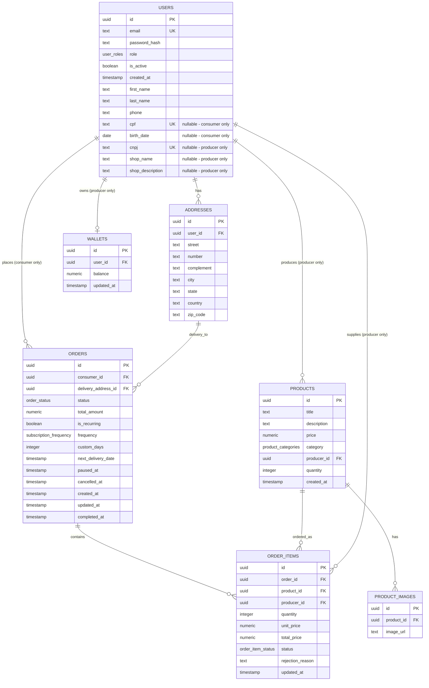

# Diagrama de Relacionamento - Hortifruti Boa Saúde API

## Visão Geral do Banco de Dados

Este documento apresenta o diagrama de relacionamento das entidades do sistema Hortifruti Boa Saúde, implementado com Drizzle ORM e PostgreSQL.

## Diagrama de Entidade-Relacionamento (Mermaid)

## Observações Técnicas

### Sistema de Usuários

1. **Tabela Unificada de Usuários**: O sistema utiliza uma única tabela `users` com um enum `user_roles` para distinguir entre consumidores, produtores e administradores. Campos específicos por role são nullable e validados na aplicação.

2. **Enum de Roles**: O enum `user_roles` define três tipos: "consumer", "producer" e "admin", garantindo type safety, consistência no banco de dados e aplicação de RBAC (Role-Based Access Control).

3. **Campos Condicionais por Role**:
   - **Consumer**: Requer `cpf` e `birth_date`
   - **Producer**: Requer `cnpj` e `shop_name`, `shop_description` é opcional
   - **Admin**: Apenas campos básicos são necessários

### Sistema de Endereços

4. **Relacionamento de Endereços**: A tabela `addresses` se relaciona com a tabela unificada `users` através do campo `user_id`, permitindo que qualquer tipo de usuário tenha múltiplos endereços.

5. **Endereços de Entrega**: Os pedidos referenciam um endereço específico através do campo `delivery_address_id`, permitindo flexibilidade na escolha do local de entrega.

### Sistema Financeiro

6. **Carteiras Exclusivas**: Apenas produtores possuem carteiras, com relacionamento 1:1 entre `users` e `wallets` (um produtor possui uma carteira).

7. **Gestão de Saldo Baseada em Aprovação**: O saldo da carteira do produtor é creditado apenas quando um item do pedido é aprovado. Se um item for rejeitado após ter sido aprovado anteriormente, o valor é debitado da carteira, garantindo que apenas itens efetivamente aprovados gerem receita.

### Sistema de Produtos

8. **Sistema de Produtos**: Apenas produtores podem criar produtos. Cada produto pertence a um produtor específico e possui uma categoria definida pelo enum `product_categories`.

9. **Gestão de Estoque Inteligente**: O estoque dos produtos é decrementado apenas quando um item do pedido é aprovado pelo produtor. Se um item for rejeitado após aprovação prévia, a quantidade é restaurada ao estoque, garantindo controle preciso do inventário baseado no status real dos pedidos.

10. **Categorias de Produtos**: O enum `product_categories` define 17 categorias específicas para hortifrúti. Frutas, Verduras, Legumes, Folhosos, Raízes, Tubérculos, Vegetais, Sementes e Grãos, Oleaginosas, Cereais, Ervas e Temperos, Cogumelos e Fungos, Brotos, Frutas Secas e Desidratadas, Exóticos / Tropicais, Orgânicos, Outros

11. **Imagens de Produtos**: Cada produto pode ter múltiplas imagens através da tabela `product_images`, com relacionamento 1:N e cascade delete (quando um produto é deletado, suas imagens também são removidas).

### Sistema de Pedidos e Assinaturas

12. **Pedidos Únicos e Recorrentes**: A tabela `orders` suporta tanto pedidos únicos quanto assinaturas recorrentes através do campo `is_recurring` e campos relacionados à frequência.

13. **Status de Pedidos**: O enum `order_status` define 6 estados: PENDING, COMPLETED, REJECTED, PARTIALLY_COMPLETED, PAUSED e CANCELLED, permitindo controle granular do fluxo de pedidos.

14. **Itens de Pedidos com Aprovação Individual**: Cada pedido pode conter múltiplos itens através da tabela `order_items`, com status individual (PENDING, APPROVED, REJECTED) para cada item, permitindo aprovação parcial por produtores. O sistema gerencia automaticamente o estoque e a carteira do produtor baseado no status de aprovação de cada item.

15. **Validação de Estoque na Criação**: Durante a criação do pedido, o sistema valida se há quantidade suficiente em estoque, mas não decrementa imediatamente. O decremento ocorre apenas na aprovação do item pelo produtor.

16. **Sistema de Assinaturas Integrado**: As assinaturas são implementadas como pedidos recorrentes com:

    - **Frequências predefinidas**: WEEKLY, BIWEEKLY, MONTHLY, QUARTERLY
    - **Frequência customizada**: Campo `custom_days` para intervalos personalizados
    - **Controle de entrega**: `next_delivery_date` para agendamento automático
    - **Gestão de status**: Campos `paused_at` e `cancelled_at` para controle do ciclo de vida

17. **Relacionamentos Complexos**: Os itens de pedidos mantêm referência tanto ao produto quanto ao produtor, permitindo rastreabilidade completa e gestão descentralizada por produtor.

### 🔧 Aspectos Técnicos

18. **Armazenamento de Imagens**: As imagens são armazenadas fisicamente na pasta `uploads/products/` e referenciadas na base de dados através da URL.

19. **Índices de Performance**: Todos os campos de email e documentos (CPF/CNPJ) possuem índices únicos para otimização de consultas e garantia de unicidade.

20. **Cascade Delete**: Implementado entre produtos e imagens, e entre pedidos e itens de pedidos, garantindo integridade referencial.

21. **Timestamps Automáticos**: Campos `created_at` e `updated_at` com valores automáticos para auditoria e controle de versão.

22. **Gestão Transacional de Estoque e Carteira**: O sistema utiliza transações para garantir consistência entre as operações de estoque e carteira, evitando estados inconsistentes durante aprovações e rejeições de itens.

23. **Controle de Re-aprovação e Re-rejeição**: O sistema rastreia o status anterior dos itens para gerenciar corretamente cenários onde um item é aprovado, depois rejeitado, e novamente aprovado, garantindo que o estoque e a carteira sejam atualizados apenas quando necessário.

---

**Data de Atualização**: 24/09/2025  
**Versão do Schema**: 2.0 (Sistema Completo com Pedidos e Assinaturas)  
**ORM**: Drizzle ORM com PostgreSQL  
**Arquitetura**: Clean Architecture com Repository Pattern
