# Diagrama de Sequência UML - Sistema de Assinaturas Hortifrúti Boa Saúde

## Visão Geral

Este documento apresenta o diagrama de sequência UML que ilustra a interação temporal entre os diferentes atores do sistema durante o processo completo de criação e gestão de assinaturas.

## Diagrama de Sequência Completo

```mermaid
sequenceDiagram
    participant C as Cliente
    participant S as Sistema
    participant DB as Database
    participant P1 as Produtor 1
    participant P2 as Produtor 2
    participant N as Sistema de Notificação

    %% Fase 1: Navegação e Descoberta
    Note over C,S: Fase 1: Navegação Pública
    C->>S: GET /products/
    S->>DB: Buscar produtos ativos
    DB-->>S: Lista de produtos
    S-->>C: Produtos disponíveis
    
    C->>S: GET /products/{id}/
    S->>DB: Buscar detalhes do produto
    DB-->>S: Dados do produto
    S-->>C: Detalhes do produto
    
    C->>S: GET /products/{id}/images/
    S->>DB: Buscar imagens do produto
    DB-->>S: URLs das imagens
    S-->>C: Galeria de imagens

    %% Fase 2: Autenticação
    Note over C,S: Fase 2: Autenticação
    C->>S: POST /auth/login
    S->>DB: Validar credenciais
    DB-->>S: Dados do usuário
    S-->>C: JWT Token + Perfil

    %% Fase 3: Criação do Pedido
    Note over C,DB: Fase 3: Configuração do Pedido
    C->>S: POST /orders/ (Assinatura WEEKLY)
    Note right of C: Payload: items[], deliveryAddressId,<br/>isRecurring: true, frequency: "WEEKLY"
    
    S->>DB: Validar endereço de entrega
    DB-->>S: Endereço válido
    
    S->>DB: Validar produtos e quantidades
    DB-->>S: Produtos disponíveis
    
    S->>DB: Criar pedido com status PENDING
    DB-->>S: Pedido criado (ID: order-123)
    
    S->>DB: Criar itens do pedido
    Note right of S: Item 1: Produto do Produtor 1<br/>Item 2: Produto do Produtor 2
    DB-->>S: Itens criados
    
    S->>DB: Calcular próxima entrega (7 dias)
    DB-->>S: next_delivery_date definida
    
    S-->>C: Pedido criado com sucesso

    %% Fase 4: Notificação aos Produtores
    Note over S,P2: Fase 4: Notificação Descentralizada
    S->>N: Notificar produtores sobre novos itens
    N->>P1: Notificação: Novo item pendente
    N->>P2: Notificação: Novo item pendente

    %% Fase 5: Processamento pelos Produtores (Paralelo)
    Note over P1,P2: Fase 5: Processamento Paralelo
    
    %% Produtor 1 - Aprovação
    P1->>S: GET /orders/items/pending/
    S->>DB: Buscar itens pendentes do produtor
    DB-->>S: Lista de itens pendentes
    S-->>P1: Itens para aprovação
    
    P1->>S: PUT /orders/order-123/items/item-1/status/
    Note right of P1: Status: APPROVED
    S->>DB: Atualizar status do item
    DB-->>S: Item aprovado
    S-->>P1: Confirmação de aprovação
    
    %% Produtor 2 - Rejeição (em paralelo)
    P2->>S: GET /orders/items/pending/
    S->>DB: Buscar itens pendentes do produtor
    DB-->>S: Lista de itens pendentes
    S-->>P2: Itens para aprovação
    
    P2->>S: PUT /orders/order-123/items/item-2/status/
    Note right of P2: Status: REJECTED<br/>Reason: "Produto fora de estoque"
    S->>DB: Atualizar status do item
    DB-->>S: Item rejeitado
    S-->>P2: Confirmação de rejeição

    %% Fase 6: Consolidação do Status
    Note over S,DB: Fase 6: Cálculo do Status Final
    S->>DB: Verificar status de todos os itens
    DB-->>S: Item 1: APPROVED, Item 2: REJECTED
    S->>DB: Atualizar status do pedido para PARTIALLY_COMPLETED
    DB-->>S: Status atualizado
    S->>DB: Calcular valor final (apenas itens aprovados)
    DB-->>S: Total recalculado

    %% Fase 7: Notificação ao Cliente
    Note over S,C: Fase 7: Notificação de Resultado
    S->>N: Preparar notificação para cliente
    N->>C: Pedido parcialmente aprovado
    Note right of C: Detalhes: 1 item aprovado,<br/>1 item rejeitado

    %% Fase 8: Monitoramento pelo Cliente
    Note over C,S: Fase 8: Acompanhamento
    C->>S: GET /orders/
    S->>DB: Buscar pedidos do cliente
    DB-->>S: Lista de pedidos
    S-->>C: Histórico de pedidos
    
    C->>S: GET /orders/order-123/
    S->>DB: Buscar detalhes do pedido
    DB-->>S: Pedido com itens e status
    S-->>C: Detalhes completos do pedido

    %% Fase 9: Ciclo de Assinatura (7 dias depois)
    Note over S,DB: Fase 9: Renovação Automática (7 dias depois)
    S->>DB: Verificar assinaturas para renovação
    DB-->>S: Assinatura order-123 ativa
    S->>DB: Criar novo pedido baseado na assinatura
    Note right of S: Novo pedido: order-456<br/>Mesmos produtos e configurações
    DB-->>S: Novo pedido criado
    S->>N: Notificar produtores sobre novo ciclo
    N->>P1: Nova rodada de aprovação
    N->>P2: Nova rodada de aprovação

    %% Fase 10: Gestão da Assinatura pelo Cliente
    Note over C,S: Fase 10: Controle da Assinatura
    C->>S: PATCH /orders/order-123/manage/
    Note right of C: Action: "pause"
    S->>DB: Pausar assinatura
    DB-->>S: Assinatura pausada
    S-->>C: Assinatura pausada com sucesso
    
    %% Reativação posterior
    Note over C,S: Reativação (tempo depois)
    C->>S: PATCH /orders/order-123/manage/
    Note right of C: Action: "resume"
    S->>DB: Reativar assinatura
    DB-->>S: Assinatura reativada
    S->>DB: Recalcular próxima entrega
    DB-->>S: Nova data calculada
    S-->>C: Assinatura reativada
```

## Análise Temporal do Diagrama

### ⏱️ Fases Temporais

#### **Fase 1: Navegação Pública (0-2 minutos)**
- **Duração**: Instantânea a alguns minutos
- **Características**: Sem autenticação, múltiplas consultas de produtos
- **Performance**: Cache de produtos para otimização

#### **Fase 2: Autenticação (10-30 segundos)**
- **Duração**: Rápida, dependente da validação
- **Características**: Validação de credenciais e geração de JWT
- **Segurança**: Verificação de papel (consumer/producer)

#### **Fase 3: Configuração do Pedido (1-3 minutos)**
- **Duração**: Dependente da complexidade do pedido
- **Características**: Validações múltiplas e cálculos
- **Transações**: Operações atômicas no banco de dados

#### **Fase 4: Notificação Descentralizada (Imediata)**
- **Duração**: Segundos
- **Características**: Notificações assíncronas
- **Escalabilidade**: Suporte a múltiplos produtores

#### **Fase 5: Processamento Paralelo (Variável)**
- **Duração**: Minutos a horas (dependente dos produtores)
- **Características**: Processamento independente e paralelo
- **Flexibilidade**: Cada produtor decide em seu tempo

#### **Fase 6: Consolidação (Instantânea)**
- **Duração**: Segundos
- **Características**: Cálculo automático do status final
- **Lógica**: Algoritmo de consolidação inteligente

#### **Fase 7: Notificação de Resultado (Imediata)**
- **Duração**: Segundos
- **Características**: Comunicação do resultado ao cliente
- **Transparência**: Detalhes completos da decisão

#### **Fase 8: Monitoramento Contínuo**
- **Duração**: Sob demanda
- **Características**: Consultas em tempo real
- **Visibilidade**: Histórico completo disponível

#### **Fase 9: Ciclo Automático (Recorrente)**
- **Duração**: Baseada na frequência configurada
- **Características**: Automação completa do processo
- **Manutenção**: Histórico preservado

#### **Fase 10: Gestão Ativa (Sob Demanda)**
- **Duração**: Instantânea
- **Características**: Controle total pelo cliente
- **Flexibilidade**: Pause, resume, cancel

### 🔄 Padrões de Interação

#### **Interações Síncronas**
- Navegação de produtos
- Autenticação
- Criação de pedidos
- Consultas de status
- Gestão de assinaturas

#### **Interações Assíncronas**
- Notificações aos produtores
- Processamento de aprovações
- Renovação automática de assinaturas
- Notificações de resultado

#### **Interações Paralelas**
- Múltiplos produtores processando simultaneamente
- Consultas independentes de diferentes clientes
- Renovações de múltiplas assinaturas

### 📊 Métricas Temporais Esperadas

| Operação | Tempo Esperado | Tipo |
|----------|----------------|------|
| Listagem de produtos | < 500ms | Síncrona |
| Detalhes do produto | < 200ms | Síncrona |
| Autenticação | < 1s | Síncrona |
| Criação de pedido | < 2s | Síncrona |
| Notificação produtores | < 5s | Assíncrona |
| Aprovação por produtor | Variável | Manual |
| Consolidação status | < 1s | Automática |
| Renovação assinatura | < 3s | Automática |
| Gestão assinatura | < 1s | Síncrona |

### 🎯 Pontos de Atenção Temporal

#### **Gargalos Potenciais**
1. **Aprovação Manual**: Dependente da disponibilidade dos produtores
2. **Múltiplos Produtores**: Tempo de consolidação aumenta com o número de produtores
3. **Picos de Renovação**: Múltiplas assinaturas renovando simultaneamente

#### **Otimizações Implementadas**
1. **Cache de Produtos**: Reduz latência na navegação
2. **Processamento Paralelo**: Produtores trabalham independentemente
3. **Notificações Assíncronas**: Não bloqueia o fluxo principal
4. **Consolidação Automática**: Recálculo instantâneo de status

#### **Monitoramento Recomendado**
1. **Tempo de Resposta**: APIs críticas < 2s
2. **Taxa de Aprovação**: % de itens aprovados vs rejeitados
3. **Tempo de Processamento**: Média de tempo dos produtores
4. **Renovações Automáticas**: Sucesso das renovações programadas

---

**Data de Criação**: 27/01/2025  
**Versão**: 1.0  
**Sistema**: Hortifrúti Boa Saúde - Marketplace de Assinaturas  
**Padrão**: UML Sequence Diagram  
**Ferramenta**: Mermaid Sequence Diagram