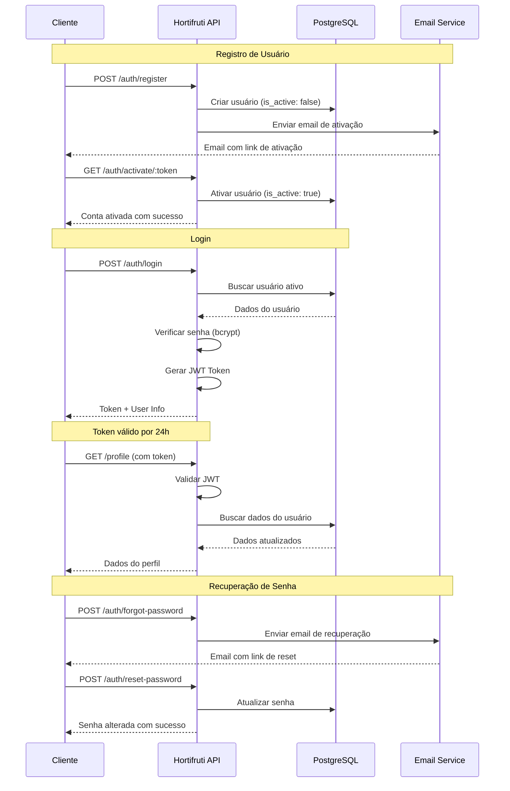

# Fluxos do Sistema - Hortifruti Boa Saúde API

## 🔄 Fluxo de Autenticação (Feature futura)

```mermaid
sequenceDiagram
    participant C as Cliente
    participant API as Hortifruti API
    participant DB as PostgreSQL
    participant EMAIL as Email Service
    
    Note over C,EMAIL: Registro de Usuário
    C->>API: POST /auth/register
    API->>DB: Criar usuário (is_active: false)
    API->>EMAIL: Enviar email de ativação
    EMAIL-->>C: Email com link de ativação
    
    C->>API: GET /auth/activate/:token
    API->>DB: Ativar usuário (is_active: true)
    API-->>C: Conta ativada com sucesso
    
    Note over C,DB: Login
    C->>API: POST /auth/login
    API->>DB: Buscar usuário ativo
    DB-->>API: Dados do usuário
    API->>API: Verificar senha (bcrypt)
    API->>API: Gerar JWT Token
    API-->>C: Token + User Info
    
    Note over C,API: Token válido por 24h
    
    C->>API: GET /profile (com token)
    API->>API: Validar JWT
    API->>DB: Buscar dados do usuário
    DB-->>API: Dados atualizados
    API-->>C: Dados do perfil
    
    Note over C,EMAIL: Recuperação de Senha
    C->>API: POST /auth/forgot-password
    API->>EMAIL: Enviar email de recuperação
    EMAIL-->>C: Email com link de reset
    
    C->>API: POST /auth/reset-password
    API->>DB: Atualizar senha
    API-->>C: Senha alterada com sucesso
```